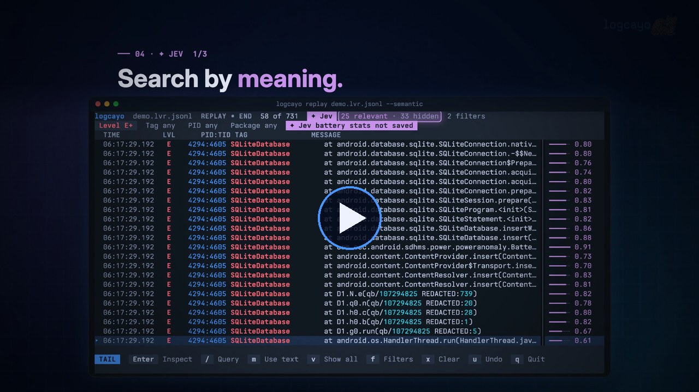
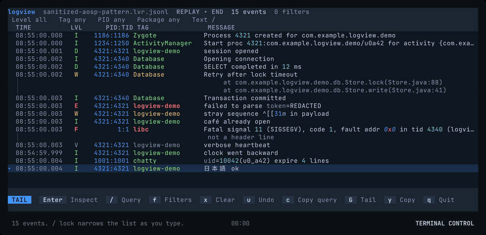
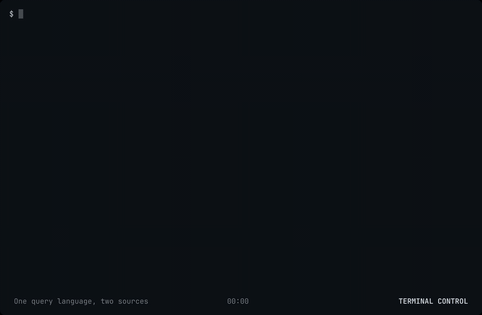
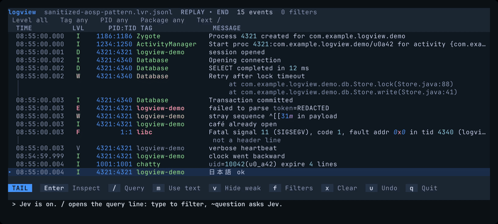

# logcayo


[](https://github.com/iurysza/logcayo/actions/workflows/ci.yml)
[](LICENSE)


A modern terminal UI for Android logs.

[](https://github.com/iurysza/logcayo/raw/main/assets/demo/logcayo-launch.mp4)

<sub>39-second launch video. Every screen is the real TUI running on a redacted Samsung capture.</sub>

logcayo streams `adb logcat` into a fast terminal viewer. Filter by level, tag, PID, package, or text as you type, then open any event to see its full message. Record a session to a file and replay it later, on your machine or in CI.

- Filter live with one query line, for example `level:W tag:Database lock`, with Tab completion from the session.
- Inspect, copy, and pivot: jump from an event to its tag or PID in one key.
- Ask Jev in plain English, for example `~battery stats not saved`, when you don't know the keyword. Press `v` to hide weak matches.
- Record once, replay at any speed, and get the same results every time.
- Let an agent query logs as JSON with `logcayo query`, without opening the viewer.



## Who is this for

- **Android developers** who live in the terminal and want something faster than scrolling through Logcat in Android Studio.
- **Anyone chasing a bug in a noisy log.** Record the session once, then replay and filter it as often as you need.
- **Coding agents and scripts.** `logcayo query` returns structured NDJSON from a recording or a live device, so an agent can read logs without screen-scraping.

logcayo is not a log shipper or a crash reporter. It reads one device at a time on your machine.

## Install

You need [Bun](https://bun.sh) 1.4 or later. You need `adb` from the Android SDK platform tools only for live capture.

```sh
git clone https://github.com/iurysza/logcayo.git
cd logcayo
bun install
cd packages/cli && bun link
```

`bun link` puts `logcayo` in `~/.bun/bin`. Add that directory to your `PATH` if needed. You can also run it from the checkout with `bun run logcayo`.

logcayo is at version 0.2. Expect changes to commands and file formats.

## Try it without a device

The repository includes a sample recording:

```sh
logcayo replay tests/fixtures/real/sanitized-aosp-pattern.lvr.jsonl
```

Press `/`, type `level:W`, and press Enter. Press `?` for all keys, and `q` to quit.

## Watch a device

Connect a device with USB debugging on, then run:

```sh
logcayo live
```

If more than one device is connected, pass `--serial DEVICE`. `adb devices` lists the serials.

To keep a session for later:

```sh
logcayo record --out sessions/bug.lvr.jsonl --duration 60
logcayo replay sessions/bug.lvr.jsonl --speed 4
```

`--speed instant` loads the whole recording at once.

## Keys

| Key | Action |
| --- | --- |
| `↑` `↓` or `j` `k` | Select the previous or next event |
| `PgUp` `PgDn` or `Ctrl-U` `Ctrl-D` | Move one page |
| `G` or `End` | Follow the newest logs |
| `Home` | Go to the first event |
| `/` | Edit the query. Tab completes, `x` clears, `u` undoes, `c` copies |
| `f` | Change filters |
| `Enter` | Inspect the event. In the inspector, `t` filters by tag and `p` by PID |
| `y` | Copy the selected event |
| `w` | Turn line wrapping on or off |
| `?` | Show help |
| `q` | Quit |

Set `NO_COLOR=1` for plain output.

## Query language

One query line filters the viewer and the CLI:

```text
level:W tag:Database pkg:com.example.app "lock timeout"
```

- `level:` shows that level and above: `V`, `D`, `I`, `W`, `E`, or `F`.
- `tag:`, `pid:`, and `pkg:` match those fields. `pkg:` resolves the package to its app UID.
- Other words search the message text. Use quotes around text with spaces.

[Query line and Jev](docs/query-and-jev.md) has the full grammar.

## Query logs from an agent

`logcayo query` streams matching events as NDJSON: one JSON object per event, then a summary line. It never opens the viewer or writes files.

```sh
logcayo query sessions/bug.lvr.jsonl 'level:W tag:Database lock' --limit 20
logcayo query --live 'pid:4321' --timeout 5s
logcayo query --check 'level:w tag:Database'
```

`--check` validates a query and prints its normalized form. Live queries stop after 10 seconds unless you pass `--timeout`. Run `logcayo query --help` for every option.



## Ask questions with Jev (optional)

Some bugs are hard to match with keywords. [Jev](https://docs.typesafe.ai/) is a hosted classifier from TypeSafe. It scores each log line against a question such as "database locks" or "why did the app restart".

Jev is off by default. It is a paid service and needs an API key. When it is on, logcayo sends the text of matching log lines to TypeSafe. Do not use it on logs that must stay on your machine.

To use it:

1. Get an API key from [TypeSafe](https://typesafe.ai) and set `TYPESAFE_API_KEY`.
2. Start logcayo with `--semantic`.
3. In the query line, put `~` before a question: `level:W ~database locks`.

Keyed terms such as `level:` still filter on your machine first. Jev scores only the events that pass them. In the viewer, a question runs when you press Enter, not while you type. `m` switches between text and Jev, and `v` hides or dims low-scoring rows.



Agents can ask the same question: `logcayo query sessions/bug.lvr.jsonl '~database locks'`.

## Documentation

- [Configuration and output](docs/configuration.md): `logcayo.json`, the capture command, JSON output, and exit codes
- [Query line and Jev](docs/query-and-jev.md): grammar, completion, and Jev states
- [Architecture](docs/architecture.md): packages, the session lifecycle, and rendering
- [Development](docs/development.md): tests, the lint gate, UI baselines, and benchmarks

## Name

logcayo is named after *Leopardus tilcayo*, a spotted cat from the Bolivian Andes and [the first new cat species found in 100 years](https://www.nationalgeographic.com/animals/article/meet-the-first-new-cat-species-discovered-in-100-years). It hid in plain sight for years. So do the log lines you're looking for.

## License

[MIT](LICENSE)
