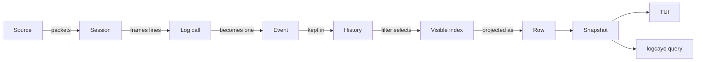

# Logcayo

Logcayo turns an Android logcat byte stream into a list of events that people and agents can filter, inspect and replay. This glossary fixes the words the code, docs and history use for that job.

## Model

## Input

**Source**:
Where packets come from: live ADB, a recording in replay, or a scripted source in tests. Every source feeds the same `Session`.
_Avoid_: stream, input, reader

**Packet**:
One chunk of raw bytes from a source, with a sequence number and time offset. Recordings store packets, not parsed events.
_Avoid_: chunk (except in the recording file format, where the line kind is `chunk`)

**Line**:
Bytes between two newlines, after framing. A line is not yet an event.
_Avoid_: entry, record

**Header**:
The logcat prefix on a line: epoch time, UID, PID, TID, level and tag. Logcat repeats the header on every line of a log call.

**Log call**:
One call to `Log.x()` on the device. Logcat splits a multi-line message into several lines with identical headers. `isSameLogCall` decides whether two lines belong to one log call.
_Avoid_: message (that is only the text part)

**Control line**:
A blank line or a `--------- beginning of` buffer marker. Control lines never become events.

## Events

**Event**:
One log call, as retained by logcayo. It has a session-local increasing ID, metadata (or none) and zero or more continuations.
_Avoid_: log, entry, item, log line

**Continuation**:
An extra line of the same log call, such as a stack frame, attached to its event. Only a line with a parsed header can be a continuation.
_Avoid_: child line, wrapped line (wrapping is a display concern)

**Unparsed event**:
An event whose line has no recognisable header (`metadata === null`). It stands alone and is never attached to the previous event.
_Avoid_: orphan, continuation

**UID**:
The Android account that emitted the log call. It is how logcayo links events to packages.

**Named UID**:
A UID that logcat prints as an account name (`root`, `radio`, `u0_a5`) because the name has at most 5 characters. The parser maps known names to their numeric AID. Unknown names parse with `uid: null`.

## Retention and view

**History**:
The bounded store of retained events, in arrival order. When full, the oldest events are evicted. Filtering never removes events from history.
_Avoid_: buffer, log list

**Visible index**:
The ordered IDs of retained events that match the active filter. The code calls it the active index.
_Avoid_: filtered list

**Tail mode / Browse mode**:
Tail follows the newest event. Browse keeps the selection fixed while events arrive. The footer shows `TAIL` or `BROWSE`.
_Avoid_: follow, paused

**Row**:
One screen line in the list: a `header` row for the event, `continuation` rows for its extra lines, or a `more` row.

**Snapshot**:
A read-only copy of what a session shows: rows, counts, view state and Jev status. The TUI and the CLI only read snapshots.

## Finding events

**Query**:
The one-line filter text shared by the TUI and `logcayo query`, for example `level:W tag:Database lock`. It parses to a `FilterSpec` and a search mode.
_Avoid_: search string, filter text

**Search mode**:
`text` or `jev`. A `~` before the first text term selects `jev`.

**Jev**:
Classification of events by meaning, through the TypeSafe API. Local keyed filters run first; Jev scores only what passes them. It is on only when `TYPESAFE_API_KEY` is set.
_Avoid_: semantic filter, semantic search, AI search. The code still uses `semantic` in module and config names; treat that as the implementation name for Jev.

**Threshold**:
The score at or above which a Jev result counts as relevant. `[` and `]` move it by 0.05 without a new request.

**Weak match**:
A scored event below the threshold. Hidden by default; `h` shows or hides weak matches.

**Settling**:
The phase after a Jev query where the previous list stays up with `classifying n/total` until the batch is scored.

## Storage

**Recording**:
A versioned JSON Lines file of packets plus a header. Replay feeds its packets through the same session pipeline as live capture.
_Avoid_: log file, dump, capture file

**Profile**:
The logcat format a recording was captured with. `threadtime-epoch-usec-v1` has no UID. `threadtime-epoch-usec-uid-v2` adds the UID column.

**Package table**:
The UID-to-packages map read from the device with `cmd package list packages -U`. New recordings store it so replay never asks a connected device.

## Names that changed

- **logview** is the project's name before 26 September 2026 (`77fe91f`). Archived documents use it.
- **`--semantic`, `m`, `v`** were earlier Jev controls. `cdd0bb3` removed them.
