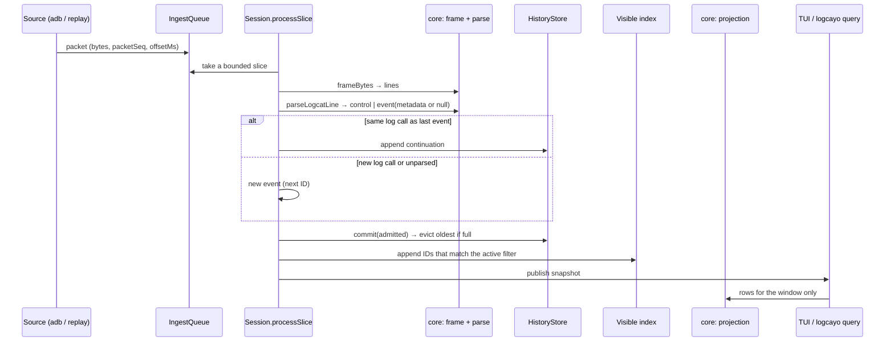

# From logcat bytes to a list row

This traces one log call from the ADB process to the screen. Read it before changing parsing, grouping or projection. Terms follow [CONTEXT.md](../CONTEXT.md). Code references are to `main` at `bb1c329` (v0.4.1).



## 1. Packets into a bounded queue

Every source produces packets. `IngestQueue.enqueue` (`packages/engine/src/ingest.ts`) rejects a packet larger than `MAX_PACKET_BYTES` or one that would overflow the queue capacity. Live capture and replay share this path; replay's recorded offsets only change timing, not results.

## 2. Framing and parsing are pure

`frameBytes` (`packages/core/src/framing.ts`) splits bytes into lines and carries partial lines across packets. `parseLogcatLine` (`packages/core/src/logcat.ts`) returns:

- `control` for blank lines and `--------- beginning of` markers. These never become events.
- `event` with `metadata`, or `metadata: null` when no header matches.

Two header patterns exist. `UID_HEADER` accepts a numeric UID or a named UID; `NAMED_UIDS` maps known names to AIDs, and `u0_aN` style names are converted from the user and app ID. `LEGACY_HEADER` handles v1 recordings without a UID column.

## 3. Grouping: the one rule that matters

`Session.processSlice` (`packages/engine/src/session.ts`) decides event boundaries:

```ts
if (parsed.metadata !== null && this.continuesLastCall(admitted, parsed.rawText, parsed.metadata)) {
  // attach as continuation
} else {
  // new event
}
```

`continuesLastCall` looks at the last event in this slice, or the newest in history, so a log call split across two packets still groups. `isSameLogCall` compares time, PID, TID, level, UID and tag.

This rule was wrong until v0.4.1: any line with `metadata === null` became a continuation of the previous event. Named UIDs made that common on real devices. See [ADR 0008](../docs/adr/0008-group-by-log-call.md).

## 4. Commit, evict, index

`commit` counts unparsed and truncated events, appends to `HistoryStore`, and prunes everything that points to evicted IDs: the visible index, any pending filter job, and the Jev coordinator. Each retained new ID is tested against the active filter, and against a pending filter if one is running, so arrivals are never lost during a re-filter. Matching IDs go to the visible index. In Browse mode, if the selected or top event was evicted, `historyExpired` is set.

## 5. Projection is lazy

The snapshot holds rows for the visible window only. `packages/core/src/projection.ts` turns an event into one `header` row plus `continuation` rows. Continuation text goes through `continuationText`, which strips the repeated header. The TUI inspector, clipboard and Jev prompt builder use the same function.

## Where to test a change here

| Change | Test first |
|---|---|
| Header shapes | `packages/core/test/logcat.test.ts` |
| Grouping or unparsed handling | `packages/engine/test/session.test.ts` |
| Fixture-visible counts | `tests/contract/filter-cases.ts`, `packages/engine/test/sanitized-fixture.test.ts` |
| What rows look like | `bun run ui:verify --scenario inspect-detail`, then review before `ui:update` |

## Open points

- [?] `logcayo query` NDJSON `continuations` still hold raw lines with the repeated header.
- [?] An OEM could add short vendor account names. They parse with `uid: null`, so the event keeps its place but loses package attribution.
