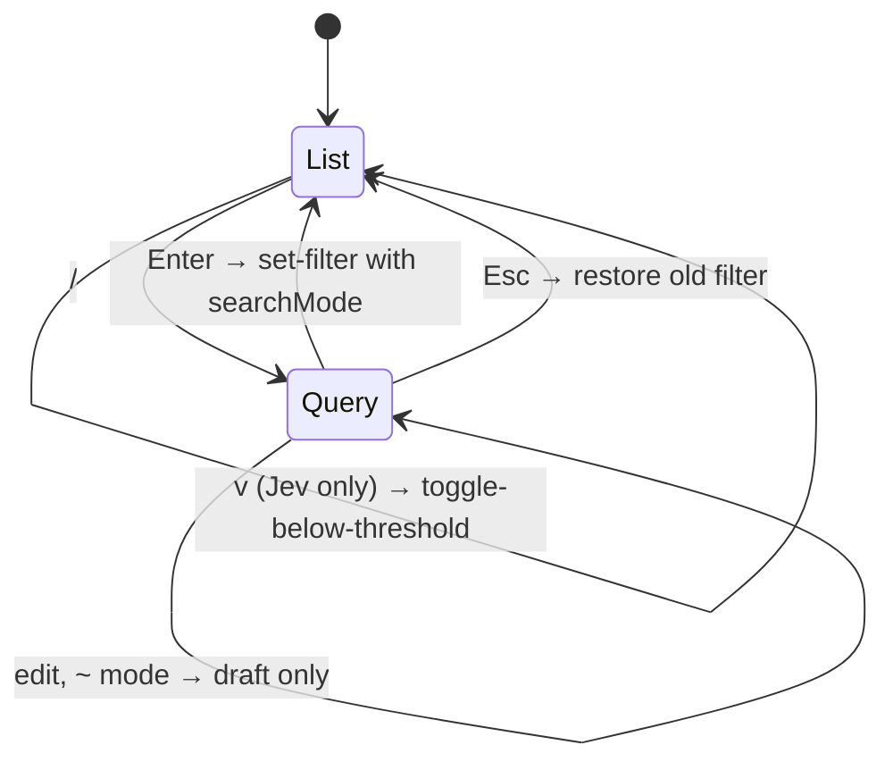
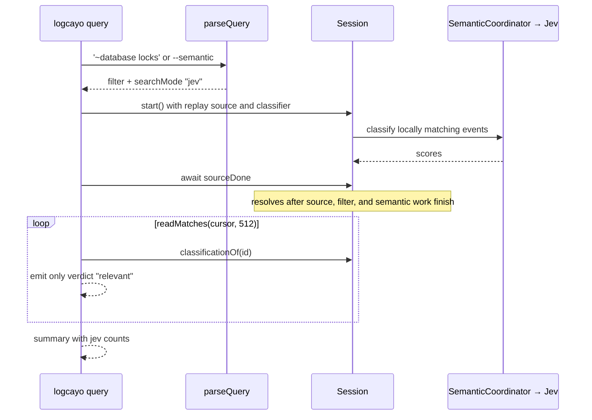

# Query line and Jev

logcayo has one filter language. The TUI `/` line and the agent command `logcayo query` both turn their input into the same query string, and `@logcayo/core` parses it. A `~` in that string switches the free text from a literal search to a question for TypeSafe Jev.

Read this page before you change the query grammar, completion, semantic states, or the CLI Jev output. [The architecture reference](architecture.md) covers the session, ingest, and terminal lifecycle this page builds on.

## Grammar

`parseQuery` and `formatQuery` live in `packages/core/src/query.ts`. The grammar is in the file header:

```text
query = term*
term  = key ":" value | ["~"] value
key   = level | tag | pid | pkg
value = bare | '"' (char | \" | \\)* '"'
```

- Keyed terms become `FilterSpec` fields: `level` → `minLevel`, `tag` → `tag`, `pid` → `pid`, `pkg` → `packageName`. A repeated key is an error.
- All other terms are text, joined with one space.
- A `~` before the first text term, or as its own term, sets `searchMode: "jev"`. A `~` later in the text is literal.
- `formatQuery(parseQuery(q))` round-trips. `c` in the TUI and `--check` in the CLI both print this canonical form.
- `parseFilterQuery` is the text-only variant and rejects `~`.

`tests/architecture/import-boundaries.test.ts` fails if engine, CLI, or TUI source calls the low-level field parsers, or if the CLI builds a `FilterSpec` by hand.

## Which filter runs

`Session` runs Jev only when three things are true (`semanticQueryActive` in `packages/engine/src/session.ts`):

1. The CLI created a classifier (`--semantic`, `semantic.enabled`, or a `logcayo query` Jev query).
2. The active `searchMode` is `"jev"`.
3. The text is not empty.

Otherwise the text is a case-insensitive literal match. In both modes the keyed fields filter locally first, so Jev only sees events that already pass `level`, `tag`, `pid`, and `pkg`.

`pkg:` is the one field that is not a pure match. The session resolves the package name to UIDs through the recording's package table or, for live capture, `adb`. It starts the filter job only after that lookup (`beginFilter` and `resolvePackageFilter`).

## TUI: live text, Jev on Enter

The query editor state lives in `packages/core/src/interaction.ts`.



- **Text mode applies on every edit.** `applyQueryDraft` dispatches `set-filter` as you type.
- **Jev mode waits for Enter.** Each apply is a paid classification, so edits in a `~` draft send nothing. `commitQuery` sends one `set-filter` with `searchMode: "jev"`.
- **A trailing `key:` is not an error while typing.** `INCOMPLETE_KEY` hides the error until Enter or an invalid value.
- **`~` without a classifier** returns the `JEV_UNAVAILABLE` error instead of a command.
- **Completion.** `completeQuery` in `packages/core/src/completion.ts` returns a ghost suffix and up to six alternatives. Values come from `Session.queryCandidates()`, which `packages/engine/src/vocabulary.ts` counts as events arrive. It keeps up to 2,000 distinct values and offers 200, most frequent first. Tab, or Right at the end of the line, accepts. Values that would need quotes are not offered.

## Semantic states

Each row carries a `ClassificationMark` (`packages/core/src/commands.ts`):

| Mark | Meaning | TUI |
| --- | --- | --- |
| `none` | Jev is not the active search | normal row |
| `unrequested` | Older than the `semantic.historyEvents` backfill window | unrequested icon |
| `pending` | Queued or in flight | clock icon |
| `scored` | Has a `relevance` from 0 to 1 | 5-cell score bar; dimmed below the threshold |
| `unknown` | `unsupported`, `too-large`, `failed`, or `skipped` | subtle "failed" state |

`SemanticStats` in the snapshot adds counts and `lastError`. The status bar turns a `ClassifierError` kind into short copy through `JEV_ERROR_COPY` in `packages/tui/src/chrome.ts`, for example `auth` → "API key rejected". An error shows once in the status bar, not on every row.

The threshold comes from the semantic options and defaults to 0.5. `v` dispatches `toggle-below-threshold`, which flips the snapshot's `belowThreshold` between `"dim"` and `"hide"`. In hide mode, `viewIndex()` builds navigation and rows from the active index minus scored rows below the threshold. It rebuilds that view after any change. `readMatches` ignores hide mode and returns every local match.

## CLI: one code path

`logcayo query` in `packages/cli/src/query.ts` does not have its own classifier. It builds the same `Session` with the same `SemanticCoordinator` the TUI uses, then reads results through the public API.



A literal query streams matches as they arrive (`stream`). A Jev query uses `streamSemantic`, which waits for `sourceDone` first, because scores arrive after events. That is also why Jev queries reject `--live`: a bounded live capture has no point at which every event is scored.

`verdictOf` maps each mark to a verdict:

- `scored` at or above the threshold → `relevant`, printed with `score` and `verdict`
- `scored` below the threshold → `below-threshold`, counted only
- any other mark → `unscored`, counted only

The summary gains `jev: {threshold, relevant, belowThreshold, unscored, error}`.

### Exit codes

| Code | When |
| ---: | --- |
| 0 | Success, including zero matches |
| 1 | `source-failure`, or `jev-failure`: Jev reported an error and scored nothing |
| 2 | `invalid-argument`, `invalid-filter`, or `missing-api-key` (`TYPESAFE_API_KEY` unset). Jev with `--live` and Jev with empty text are both 2. |

## Tests

- `packages/core/test/` covers the grammar, round-trips, completion, and the editor rules above.
- `packages/engine/test/semantic.test.ts` covers the coordinator, states, and hide mode.
- `packages/cli/test/query.test.ts` includes "agent query CLI with Jev". It runs against `tests/support/fake-jev.ts`, a local server reached through the SDK's `TYPESAFE_BASE_URL`, so no test calls the real service and product code has no test hooks.
- The shared contract table in `packages/tui/test/ui-state.test.ts` runs 11 queries through the CLI and a key-by-key TUI session and requires the same event IDs.
- UI scenarios `jev`, `jev-error`, and `autocomplete` capture each visible state. See `packages/tui/test/support/ui-scenarios.ts`.

## Open points

- [?] The TUI does not yet hide `v` when the query has no text. With Jev enabled and an empty query, the footer still offers `m Use text` and `v Hide weak`.
- [proposed] A CLI flag to print below-threshold and unscored events, not only count them.
